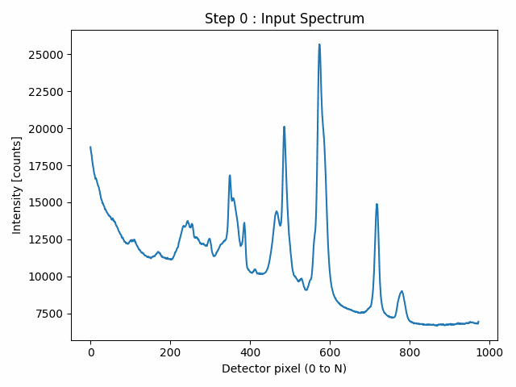

# ORPL

ORPL (read _orpel_) is the Open Raman Processing Library. It provides tools for the processing of Raman spectrum including;

1. System calibration (x-axis and system response)
2. Cosmic Ray removal
3. Baseline removal (autofluorescence)
4. Spectrum analysis (peak finding, ...)
5. Synthetic spectrum generation (for testing and benchmarking)

## Installation

ORPL is hosted and distributed through the python package index (https://pypi.org/project/orplib/) and can be installed with pip.

```
pip install orplib
```

If you have a virtual environment configured, don't forget to first activate the environment.

You can verify the installation by doing a `pip list`.

## Baseline removal

### BubbleFill

Bubblefill is a morphological processing algorithm designed for the removal of baselines in spectroscopic signal. It was created and optimized specifically to remove autofluorescence baselines in Raman spectra measured on biological samples.



The tuning parameter of Bubblefill is the size of the smallest bubble allowed to grow. In general, the smallest bubble width should be chosen to be larger than the widest Raman peak present in the signal. Otherwise, the baseline fit will _grow_ inside the peaks and the output Raman signal will have under expressed peaks.

**Note** : Bubbles can become arbitrarily small if they are growing along the leftmost or rightmost edge of the signal.


Different smallest bubble widths can be specified for different regions of the spectrum. This enables nearly infinite tuninig of the algorithm and can be used to removed peaks that are known artifacts (for instance). In this example, the smallest bubble width for detector pixels 400 to 650 was set to 1 and to 100 for the rest of the x-axis.


## How to cite this work

G. Sheehy et al., “Open-sourced Raman spectroscopy data processing package implementing a baseline removal algorithm validated from multiple datasets acquired in human tissue and biofluids” J. Biomed. Opt., article accepted issue to be published soon.

### Contributors

- **Guillaume Sheehy** | guillaume.sheehy@polymtl.ca
- **Frédérick Dallaire**
- **Fabien Picot**
